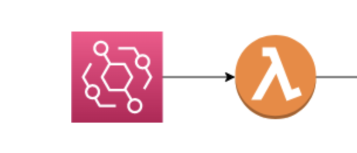
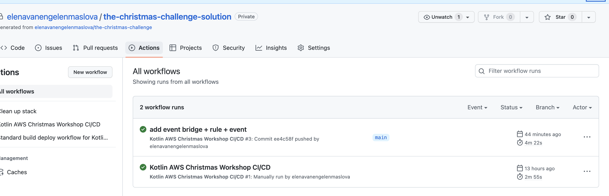
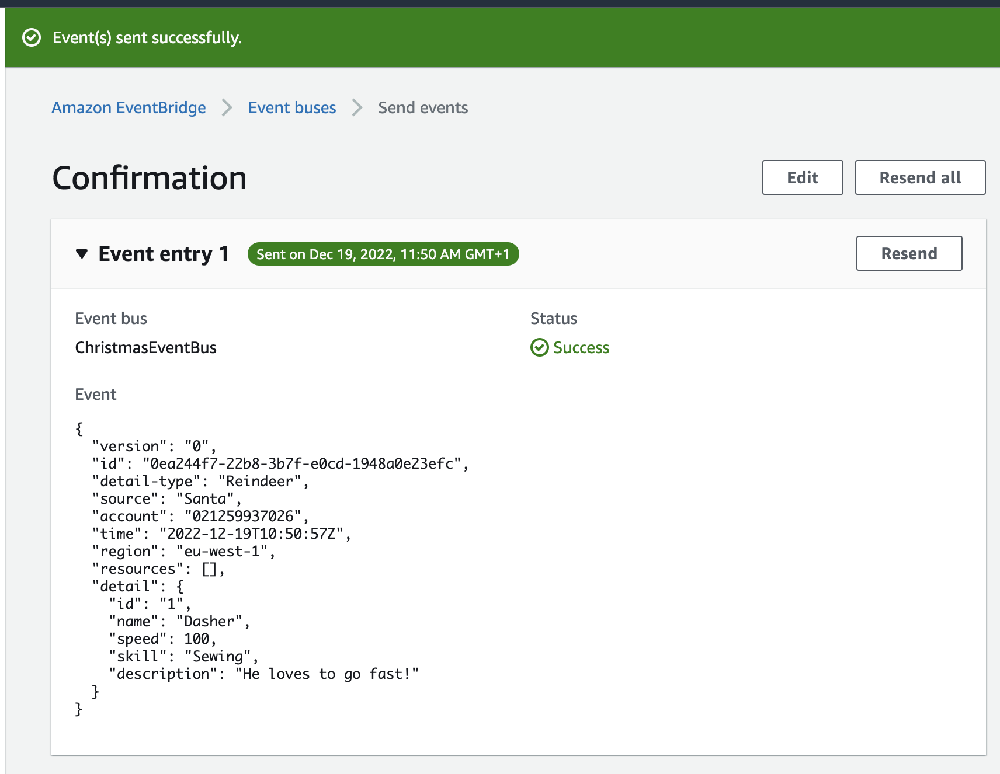
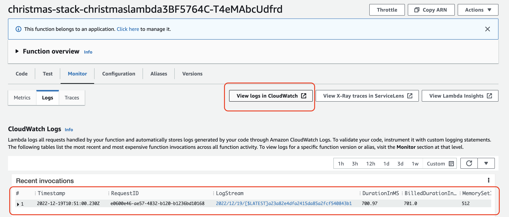
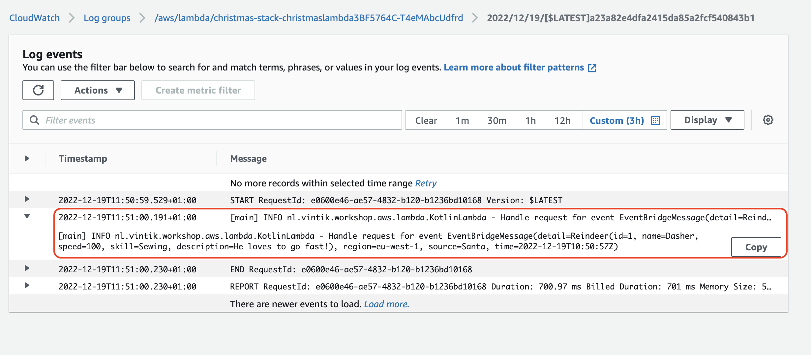

= 3. Add event bus on AWS EventBridge

Here we are going to add EventBridge event bus and event rule with our Lambda as target, so that Lambda gets evoked for every event placed on event bus.

== 3.1 Implement an event
First we need to add a data class that will contain event data, and update our lambda handler to receive that data.
Create package `nl.vintik.workshop.aws.lambda.model` and place EventBridgeMessage data class in that package:
[source,kotlin]
----
data class EventBridgeMessage <T>(
    var detail: T? = null,
    var region: String = "",
    var source: String = "",
    var time: String = ""
)
----
This is a generic container data class for event bridge events, can be reused.

Add Reindeer data class to the same package, this is our specific event detail data class:
[source,kotlin]
----
data class Reindeer(
    var id: String = "",
    var name: String = "",
    var speed: Int = 0,
    var skill: String? = null,
    var description: String? = null
)
----

Note: both data classes have default constructor enabled and are mutable, this is because we are using default serialization mechanism of AWS SDK for java which creates object before it populates it with data.

Now update our Lambda handler `KotlinLambda` to receive event bridge event:
[source,kotlin]
----
class KotlinLambda : RequestHandler<EventBridgeMessage<Reindeer>, String> {
    private val logger = LoggerFactory.getLogger(this::class.java)

    override fun handleRequest(event: EventBridgeMessage<Reindeer>, context: Context): String {
        logger.info("Handle request for event $event")
        return "Merry Christmas!"
    }
}
----

== 3.2 Create an event bus and rule in CDK infrastructure

Now that Lambda code is ready to receive events from EventBridge, we can add infrastructure for the event bus and event rule with our Lambda as target. Update `InfrastructureChristmasStack` assigning lambda function to `val function` and by adding:

[source,kotlin]
----
       //create event bus
        val eventBus =
            EventBus.Builder.create(this, "eventBus")
                .eventBusName("ChristmasEventBus")
                .build()

        //add rule and configure our lambda as target
        Rule.Builder.create(this, "eventRule")
            .eventBus(eventBus)
            .eventPattern(EventPattern.builder()
                .source(listOf("Santa"))
                .build())
            .targets(listOf(LambdaFunction(function)))
            .build()
----

To build the changes locally you can run:
[source,sh]
----
./gradlew build
----

Let's roll this out and try it in AWS console. Commit and push the changes to github, this will start the CI/CD pipeline for rolling out our app to AWS account. Check CI/CD pipeline has succeeded by navigating to Actions tab of your GitHub repository:

Login to AWS Console and navigate to EventBridge, then under Busses menu on the left select Event busses. On the Event busses page select "Send events" button:

image::images/SendEventButton.png[send-events-button]

Fill in event entry form. For event bus, select our new `ChristmasEventBus` from the dropdown; fill `Santa` in EventSource field; fill `Reindeer` in Detail type, this field is currently not used in our event rule, but could be also used to filter events. In Event detail fill in the following json which matches our Reindeer data class:
[source,json]
----
{
  "id": "1",
  "name": "Dasher",
  "speed": 100,
  "skill": "Sewing",
  "description": "He loves to go fast!"
}
----

Then press the Send button, and you should now see a success page:

Let us now check if Lambda has processed our event. Go to AWS Lambda service, search for Christmas and select Lambda with description "Kotlin Lambda for Christmas". Then select Monitor tab. Your should see yoour invocation in Recent invocations table, however if the logs are not there yet, select "View in Cloudwatch button":

You should see your new Reindeer event in the latest log:

➡️ link:./4-add-dynamoDB.adoc[4. Write to DynamoDB Table]

⬅️ link:./2-generate-workshop-project.adoc[2. Generate and configure a workshop project in GitHub]