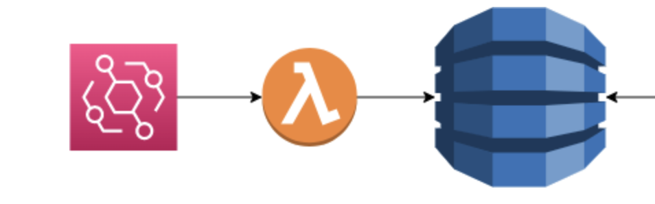

= 4. Write to DynamoDB Table

In this part of the exercise we are going to create a DynamoDB table where we can save our Reindeer payload. Then we need to add permission to our Lambda to write to the new table. Finally, we need to add code to the lambda to save the event payload to the new table.

== 4.1 Add DynamoDB Table in CDK infrastructure

Add a DynamoDB table `Reindeer` to our `InfrastructureChristmasStack` CDK stack. Configure `id` as partition key, and set provisioned read and write capacity to 4. Free tier allows up to 25 read and write capacity units.
[source,kotlin]
----
        val tableName = "Reindeer"
        val reindeerTable = Table.Builder.create(this, tableName)
            .tableName(tableName)
            .partitionKey(
                Attribute.builder()
                    .type(AttributeType.STRING)
                    .name("id")
                    .build()
            )
            //Note: for workshop DESTROY setting is good because when we clean up we do not want to retain anything.
            //On production usually one would use RETAIN or SNAPSHOT so that the data is not lost if the stack is deleted.
            .removalPolicy(RemovalPolicy.DESTROY)
            .pointInTimeRecovery(false)
             //Setting to keep ourselves within the free tier
            .billingMode(BillingMode.PROVISIONED)
            .readCapacity(4)
            .writeCapacity(4)
            .build()

        reindeerTable.grantWriteData(function)
----
➡️ link:./5-add-app-sync.adoc[5. Add AppSync configuration for GraphQL]

⬅️ link:./3-add-event-bus.adoc[3. Add event bus on AWS EventBridge]