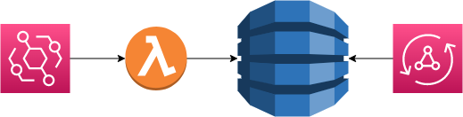

= 5. Add AppSync configuration for GraphQL

As a final part to our simple event driven application, we shall expose our data via GraphQL though AppSync

For this task we only need to update our infrastructure.

➡️ link:./7-clean-up.adoc[6. Clean up resources]

⬅️ link:./4-add-dynamoDB.adoc[4. Write to DynamoDB Table]