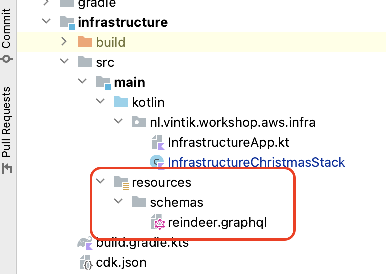

= 5. Add AppSync configuration for GraphQL

As a final part to our simple event driven application, we shall expose our data via GraphQL though AppSync

image::images/EventApp.png[lambda-to-dynamo]

For this task we only need to update our infrastructure.

First let us define out graphql schema. In `infrastracture` -> `src` -> `main` create the following `resources` structure:

Put the following schema definition in the `reindeer.graphql`:

[source,graphql]
----
type Reindeer {
    id: String!
    name: String!
    speed: Int!
    skill: String
    description: String
}

type Query {
    getReindeerById(id: String!): Reindeer
}

type Schema {
    query: Query
}
----

Finally, let us update our `InfrastructureChristmasStack` with GraphQL API by adding:

[source,kotlin]
----
        //Add GraphQL API to get Reindeers
        val apiName = "ReindeerApi"
        val reindeerApi = GraphqlApi.Builder.create(this, apiName)
            .name(apiName)
            .schema(SchemaFile.fromAsset(this::class.java.getResource("/schemas/reindeer.graphql")!!.path))
            .authorizationConfig(
                AuthorizationConfig.builder()
                    .defaultAuthorization(
                        AuthorizationMode.builder()
                             //API Key is the simplest authorisation option, good enough for our workshop
                            .authorizationType(AuthorizationType.API_KEY).build()
                    ).build()
            ).logConfig(
                LogConfig
                    .builder()
                    .fieldLogLevel(FieldLogLevel.ERROR)
                    .build()
            )
            .build()

        // This is a resolver definition for out GraphQl query
        reindeerApi.addDynamoDbDataSource("getReindeerById", reindeerTable).createResolver(
            "resolveById",
            BaseResolverProps.builder()
                .typeName("Query")
                .fieldName("getReindeerById")
                .requestMappingTemplate(MappingTemplate.dynamoDbGetItem("id", "id"))
                .responseMappingTemplate(MappingTemplate.dynamoDbResultItem())
                .build()
        )
----

We are now good to get, lets commit and push our GraphQL API and check it in AWS Console when it is deployed.

➡️ link:./7-clean-up.adoc[6. Clean up resources]

⬅️ link:./4-add-dynamoDB.adoc[4. Write to DynamoDB Table]