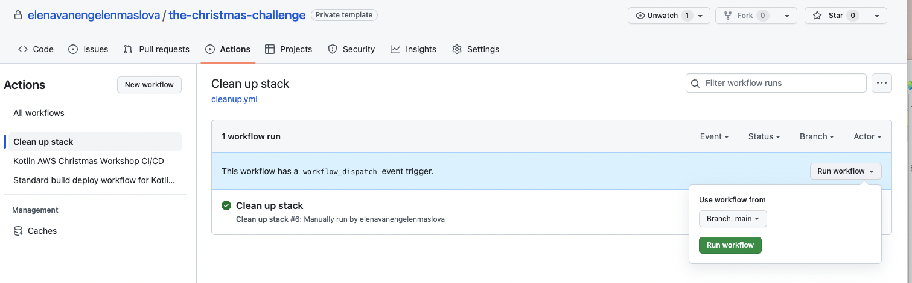

= 7. Clean up resources

Well done! You have completed The Christmas Challenge!

[NOTE]
====
Please do this step only after we go through the solutions to The Christmas Challenge.
====

Now it is time to clean up.

In order to remove our serverless resources in AWS account go to GitHub\]
actions tab and run "Clean up stack" workflow:

⬅️ link:./5-add-app-sync.adoc[5. Add AppSync configuration for GraphQL]